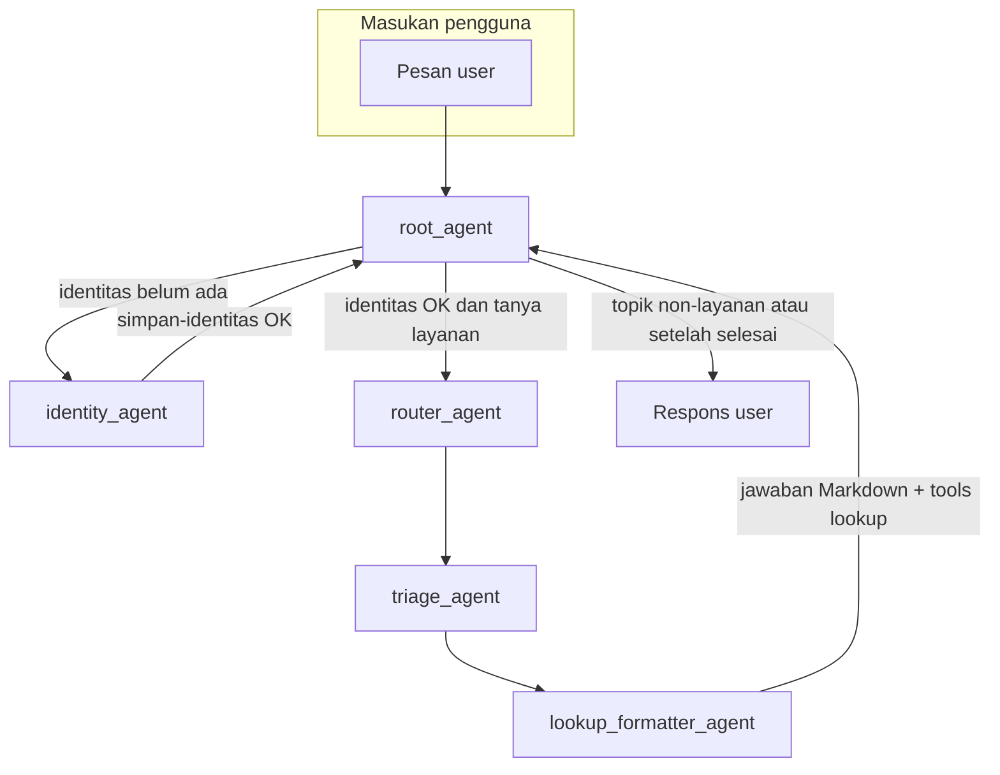
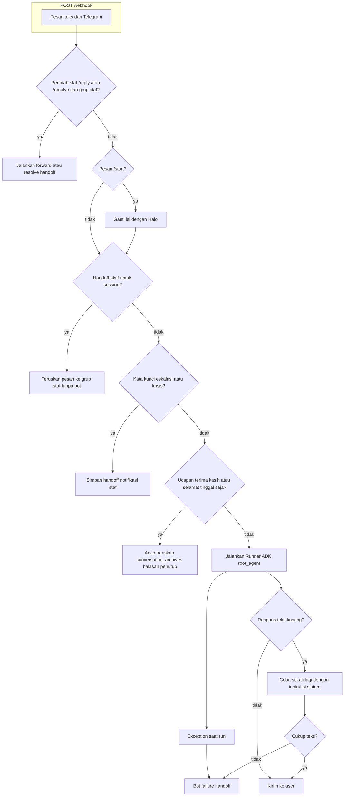

# Narasi proses bisnis dan workflow chatbot KJRI Dubai

Dokumen ini mendeskripsikan **proses bisnis** (dilihat dari sudut pengguna dan layanan konsuler) dan **workflow teknis** yang diimplementasikan di basis kode: multi-agent Google ADK, integrasi MCP Toolbox ke PostgreSQL, saluran Web dan Telegram, eskalasi ke petugas, serta arsip penutupan percakapan.

---

## 1. Tujuan bisnis

Chatbot bertindak sebagai **penasihat layanan konsuler** bagi WNI di wilayah kerja KJRI Dubai. Tujuannya:

- **Mengarahkan** pengguna dari bahasa sehari-hari (“paspor hilang”, “anak lahir di Dubai”) ke **satu layanan yang relevan** tanpa mengharuskan mereka menguasai istilah administratif.
- **Menyampaikan** ringkasan layanan, persyaratan, dan biaya dalam **AED** hanya jika data tersebut bersumber dari alat data (tool); tidak mengarang angka atau syarat.
- **Mencatat** identitas (minimal nama) dan interaksi untuk analitik serta jejak layanan.
- **Mengalihkan** ke petugas manusia bila pengguna meminta kontak manusia, situasi krisis terdeteksi, bot gagal memberi jawaban, atau percakapan perlu ditangani di luar kemampuan otomatis.

Desain “Service Navigator” (routing domain → triage singkat → pencarian detail) diwujudkan dalam rantai sub-agen di bawah `root_agent`; rincian kontrak output (urutan bagian Markdown) sejalan dengan petunjuk proyek di `CLAUDE.md` dan instruksi agen lookup.

---

## 2. Pihak terlibat

| Pihak / sistem | Peran |
|----------------|--------|
| **Pengguna** | Mengakses lewat UI agen (HTTP, biasanya `localhost:8000`) atau **Telegram** (webhook ke layanan bot). |
| **root_agent** | Orkestrator ADK: mengalihkan ke sub-agen sesuai tahap dan menjaga **gate identitas**. |
| **Sub-agen** | `identity_agent`, `router_agent`, `triage_agent`, `lookup_formatter_agent` — masing-masing punya instruksi dan tool terbatas. |
| **MCP Toolbox** | Menyediakan fungsi SQL terbungkus sebagai tool: `simpan-identitas`, `cari-layanan`, `cari-layanan-semantik`, `get-detail-layanan`, `simpan-interaksi`, dll. |
| **PostgreSQL** | Menyimpan `pengguna`, `layanan` / data konsuler, log `chat_sessions`, antrean `handoff_queue`, dan `conversation_archives`. |
| **Petugas KJRI** | Menerima notifikasi di grup Telegram (jika dikonfigurasi); membalas pengguna via `/reply`, menutup tiket via `/resolve`. |
| **Model LLM** | Dikonfigurasi lewat `LLM_PROVIDER` / `LLM_MODEL` (mis. Ollama atau Gemini); pencarian semantik layanan memakai embedding (mis. Gemini) sesuai setup lingkungan. |

---

## 3. Narasi alur nilai (dari sisi pengguna)

1. **Pertama kali berbicara**, pengguna diminta mengisi **identitas** — setidaknya **nama lengkap** — dan data disimpan lewat tool `simpan-identitas`. Tanpa langkah ini, orkestrator **tidak** memproses penjajakan layanan konsuler mendalam (gate keamanan di `root_agent`).
2. Setelah identitas tersimpan, jika pengguna **menanyakan layanan**, percakapan masuk ke **routing**: domain perkiraan (paspor, catatan sipil, legalisasi/dokumen, darurat/kepulangan) dari kata kunci atau satu pertanyaan pemilihan jika ambigu.
3. **Triage** mengajukan hingga beberapa pertanyaan singkat per domain untuk mempersempit ke satu skenario layanan.
4. **Lookup dan format** memanggil pencarian (kata kunci dan/atau semantik) lalu **detail layanan**, lalu menyusun jawaban Markdown terstruktur: konteks singkat, ringkasan layanan, persyaratan, biaya (AED), dan langkah berikutnya — serta mencatat interaksi dengan `simpan-interaksi` bila alur mengharuskan.
5. Jika pengguna **puas dan mengucapkan terima kasih/perpisahan** (pada saluran Telegram dengan pola tertentu), sistem dapat **mengarsipkan** transkrip singkat dan membalas penutup tanpa menjalankan lagi alur layanan penuh.
6. Jika pengguna **meminta petugas**, mengisyaratkan krisis, atau **bot tidak menghasilkan teks**, tiket masuk **antrean handoff**; percakapan dapat dilanjutkan oleh staf melalui Telegram.

---

## 4. Workflow teknis: pipeline agen ADK

Orkestrasi dan urutan transfer ada di [`chatbot_kjri_dubai/agent.py`](../chatbot_kjri_dubai/agent.py). **Gate**: transfer ke `router_agent`, `triage_agent`, atau `lookup_formatter_agent` hanya setelah identitas terkonfirmasi (tool `simpan-identitas` telah dipakai).

**Ringkas per sub-agen**

- **identity_agent** — mengumpulkan dan menyimpan identitas; tool utama: `simpan-identitas` (lihat [`agents/shared.py`](../chatbot_kjri_dubai/agents/shared.py)).
- **router_agent** — mendeteksi domain dari kata kunci / pertanyaan pilihan.
- **triage_agent** — menanyakan fakta tambahan (maks. sesuai desain domain).
- **lookup_formatter_agent** — `cari-layanan`, `cari-layanan-semantik`, `get-detail-layanan`, `simpan-interaksi`; dapat memanfaatkan RAG dokumen lewat `cari_dokumen_rag` untuk materi panduan, **bukan** menggantikan biaya/persyaratan resmi dari DB layanan.

---

## 5. Workflow teknis: saluran Telegram (webhook)

Alur utama ada di [`chatbot_kjri_dubai/telegram_bot.py`](../chatbot_kjri_dubai/telegram_bot.py): pesan masuk dievaluasi **berurutan** sebelum atau mengganti eksekusi agen.

**Detail perilaku penting**

- **Session** Telegram: `session_id = telegram_<chat_id>`; ini mengikat sesi ADK in-memory dengan percakapan pengguna.
- **Handoff aktif** (`has_active_handoff`): pengguna tidak lagi memproses lewat agen; pesan diteruskan ke grup staf (jika grup dikonfigurasi).
- **Eskalasi** (`detect_escalation_trigger` di [`handoff.py`](../chatbot_kjri_dubai/handoff.py)): pola agen/manusia/krisis — tiket dibuat, staf dinotifikasi, pengguna mendapat pesan konfirmasi.
- **Penutupan** (`detect_gratitude_closure` di [`conversation_archive.py`](../chatbot_kjri_dubai/conversation_archive.py)): jika cocok (bukan kombinasi ucapan terima kasih + pertanyaan lanjut), buffer transkrip diarsipkan dan balasan penutup dikirim **tanpa** menjalankan agen.
- **Jawaban kosong**: sekali **nudge** internal; jika masih kosong → **bot-failure handoff** dengan deduplikasi (handoff aktif, cooldown `HANDOFF_BOT_FAILURE_COOLDOWN_SEC`).
- **Latar belakang**: loop setiap ~60 detik untuk **timeout handoff** (menyelesaikan tiket tidak aktif sesuai logika di modul handoff).

Saluran analytics (`CHANNEL=telegram` vs `web`) memengaruhi pencatatan interaksi sesuai pengaturan lingkungan.

---

## 6. Batas tanggung jawab bot vs petugas

| Situasi | Perilaku |
|---------|-----------|
| Informasi layanan rutin setelah triage | Bot menyusun jawaban dari tool; mencatat interaksi. |
| Pengguna minta manusia / kata kunci krisis | Tiket `handoff_queue`, notifikasi grup, konfirmasi ke pengguna. |
| Bot tidak menghasilkan teks atau error run | Bot-failure handoff dengan aturan cooldown dan cek handoff aktif. |
| Tiket masih aktif | Bot tidak menjawab; pesan user diteruskan ke staf. |
| Staf membalas `/reply session_id pesan` | Pesan dikirim ke chat pengguna; status dapat `in_progress`. |
| Staf `/resolve session_id` | Handoff diselesaikan; pengguna dapat diinformasikan kembali ke mode bot. |

---

## 7. Referensi implementasi

| Topik | File |
|--------|------|
| Aturan transfer root + sub-agen | [`chatbot_kjri_dubai/agent.py`](../chatbot_kjri_dubai/agent.py) |
| Webhook Telegram, transkrip, nudge, bot failure | [`chatbot_kjri_dubai/telegram_bot.py`](../chatbot_kjri_dubai/telegram_bot.py) |
| Eskalasi, DB handoff, notifikasi, cooldown | [`chatbot_kjri_dubai/handoff.py`](../chatbot_kjri_dubai/handoff.py) |
| Deteksi penutupan dan arsip | [`chatbot_kjri_dubai/conversation_archive.py`](../chatbot_kjri_dubai/conversation_archive.py) |
| Toolscope dan model | [`chatbot_kjri_dubai/agents/shared.py`](../chatbot_kjri_dubai/agents/shared.py) |

---

*Versi dokumen ini diselaraskan dengan perilaku kode pada cabang kerja saat penyusunan; jika alur berubah, perbarui dokumen ini bersama perubahan orkestrasi atau webhook.*
